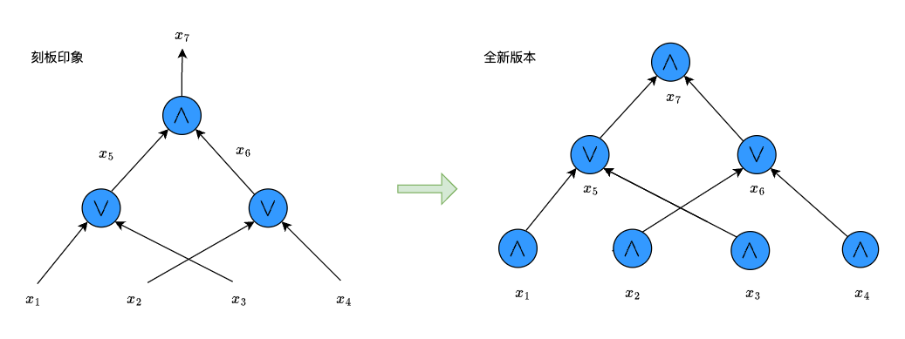

# Nova From Scratch

> 作者: Xor0v0

## 1. 蓝图

这一系列我们将从 0 开始学习 Nova , 整合网上零零散散的学习资源, 从理论直觉到原型代码分析两个角度来剖析 Nova 递归证明系统.

Nova 证明系统其实分为两个组件, 分别是对 IVC Instance-Witness pairs 的**折叠** (Fold) 和对折叠之后的最终 Instance-Witness pair 的**证明** (论文中使用的是 Spartan 证明系统).

有人可能对上述描述感到困惑:

- 什么是 IVC ? 
- 什么是 Instance-Witness pair?
- 什么又是 Spartan?
- 我们为什么需要 Nova?
- ...

其实不止这些, 在学习过程中我们会不断的产生新的疑惑, 本系列文章的目的就是: **从菜鸟角度解读Nova, 尽可能详尽地阐明这些困惑点**.

## 2. Why-What-How

### 为什么需要递归证明?

在实际应用中使用ZK证明系统时，必须意识到: **一个复杂且庞大的计算在单个证明系统中证明是低效且不切实际的**。这是因为我们需要把计算任务转换成电路，然后把电路、公共输入以及见证输入到证明系统中生成证明。当电路规模增加到一定数量级之后，证明速率会大大降低，甚至证明者由于实际内存限制根本无法生成证明。

再者，需要注意我们通常要求证明系统的**验证复杂度不能太高**，也就是所谓的简洁性 succinctness，在ZKP上下文中，简洁性一般指电路规模的多项式对数（poly-logarithmic）级别。【多项式对数是一种复杂度计算术语，本章后文会介绍】

在上述两点的条件限制下，如何对一个复杂且庞大的计算在单个证明系统中进行证明，并且保证验证者的验证成本在可接受范围内呢？

研究人员提出了三种「高效」证明思想：

1. 证明组合（Proof Composition）：将使用不同特点的证明系统组合起来以生成最终证明。比如可以先使用一个快速的证明系统，但是可能生成的proof size较大。为了减小proof size，可以再组合一个较慢的证明系统，用于证明「快证明系统」的证明可以通过验证者验证。注意，第二个「慢证明系统」其实证明的是第一个「快证明系统」的验证者电路，而验证者电路一般复杂度是较低的。因此，通过证明组合，我们可以实现用相对较快的方式证明一个复杂的计算电路的运行过程。

2. 证明聚合（Proof Aggregation）：将多个proof聚合成一个单一的proof。比如zkEVM包含了许多不同的电路，如EVM电路、RAM电路、存储电路等。在实践中，验证所有这些证明在区块链上是非常昂贵的。因此，我们使用证明聚合，即使用一个证明来证明这些多个子电路证明是有效的。这个单一的证明在区块链上更容易被验证。因此，这种证明思想下，需要首先各自运行证明系统分别生成证明，最后使用一个聚合证明的证明系统以证明各个证明的验证有效性和聚合的合法性。这种时间复杂度还是很高的。

3. 证明递归（Proof Recursion）：这是一种更为高明的证明思想，它旨在把复杂业务电路分割成相对小的计算电路，然后构建一连串验证者电路（**即每次运行业务电路时，顺带着把上一次的电路运行证明进行部分或者全部验证**），这样可以有效的**摊销**验证成本。如果每次运行的业务电路是一样的（即IVC，见后文解释），那么这样每一步我们可以生成一个比前一个证明更容易验证的证明。最终，我们只需要用最低的复杂度来验证最终的证明。

> 注意上述加粗语句中，部分验证对应于Accumulator，全部验证对应于Folding。

通过上面的解释可知：递归证明是证明一个复杂且庞大的电路最有效的解决方案。

### Nova可以解决什么问题?

正如之前所述，实际应用中总是希望能够证明多个计算任务（大型复杂的计算任务可以拆解成多个小的计算任务，比如zkVM）的正确运行。Nova，它是一种基于折叠Folding的证明技术，它的最主要用途就是实现高效证明IVC。

IVC，增量可验证计算 (Incrementally Verifiable Computation): 给定一个计算任务，这个计算是循环执行函数 $F$。比如，区块链上处理交易，我们把它抽象成一个函数 $F$，它以原始区块链状态和新的交易作为输入，输出更新之后的区块链状态。

一个非常自然的证明方案是：每次运行 SNARK 方案，然后输出更新之后的区块链状态及其proof，然后在下一次运行状态更新函数之前，需要先验证上一次proof的正确性，然后在执行这一次的运行证明，如此往复。

显然上述方案是低效的，一个比较高明的想法是，我们把验证函数也写成电路，然后将其与下一次执行函数一起运行并证明。这样引入了一个新的问题，验证函数并不适合转换成电路，比如配对pairing部分。于是研究人员提出了延迟验证的想法，即把不易验证的部分延迟到最后去验证，这就是所谓的累加Accumulator方案，代表作有Halo系列证明系统。而Nova证明系统，则更为彻底，它把前一步的验证步骤全部执行，不需要延后验证。

而Nova的变种方案，则是在Nova基础上更进一步了：

- SuperNova：不同于Nova只能证明IVC（即同样的计算任务），它将Nova推广到non-uniform IVC上，即我们在IVC链上能运行多个方法，并且每个方法都可能在IVC上出现多次。
- Sangira：是针对于 PLONKish 算术化的 folding 方案。它支持复制约束（copy constraints）和 2 阶的自定义约束（degree-2 custom constraints），但不支持高阶自定义约束（high degree custom constraints）和查找约束（lookup constraints）。
- HyperNova：引入了Customizable Constraint Systems（CCS）算术化的折叠方案。 HyperNova 支持高阶自定义约束和查找约束，并使用sum-check protocol来避免执行大量的FFT（快速傅里叶变换）。
- ProtoStar：进一步增强了折叠方案，支持高阶自定义约束、查找约束和non-uniform IVC。
- 故事未完待续...

### 如何学习Nova?

本系列文章的主要两个组件为线索, 分别阐明两个组件(或者说协议)的构建细节, 因此只对某一个组件(甚至组件中某个细节)感兴趣的同学可以自由跳读: 
- `Fold`: 第 2 ~ x 章
- `Spartan`: 第 x ~ 最后一章

## 3. 预备知识

为了让大家处于同一出发点, 我们需要明确一些基本概念.

### 计算复杂性理论

[计算复杂性理论](https://en.wikipedia.org/wiki/Computational_complexity_theory)是理论计算机科学和数学的一个重要分支, 它致力于将可计算问题根据它们本身的复杂性分类，以及将这些类别联系起来. 一个可计算问题被认为是一个原则上可以用计算机解决的问题，亦即这个问题可以用一系列机械的数学步骤解决，例如算法。

计算复杂性理论的研究对象是可计算问题的算法在执行时所需要的计算资源. 这里涉及三个重要的概念: 「可计算问题」, 「计算模型」和「计算资源」. 

- 可计算问题: 最常见的可计算问题是决策 ( decision) 问题 (输出是或者否), 当然还有其他问题比如函数问题, 优化问题, 计数问题等.
- 计算模型: 定义了算法如何执行, 是算法的载体. 常见的计算模型是图灵机模型, 特别是确定性图灵机 (DTM) , 除此以外还有电路模型. 图灵机模型是简单抽象的, 可以模拟任何算法, 为理论分析提供了简洁统一的框架. 

    Q1: 现代计算机的底层都是电路, 为什么不经常用电路模型而用图灵机模型?

    A1: 图灵机模型只是对电路模型更高级的抽象, 因为在研究一般计算问题时我们不需要考虑低层次的电路逻辑操作, 图灵机模型显然更为方便和有力. 必须强调的是: **图灵机模型和电路模型在计算能力上是等价的, 只是前者提供的抽象能力更加有利于理论分析**, 仅此而已.

    Q2: 为什么证明系统领域 (包括ZKP领域) 论文大多考虑电路模型?

    A2: **这是因为在零知识证明系统的目的就是验证这些底层逻辑运算的正确性, 因此使用电路模型能够更加有效地表达这些运算, 进而便于我们构建零知识证明系统**. 

- 计算资源: 一般而言我们考虑两种资源: 时间和空间. 当然具体问题可能会考虑其他的资源, 比如通信时会考虑通信量(带宽), 并行问题会考虑处理器核数等. 

    在图灵机模型中, 一般研究输入规模 $n$ 在算法中的时间和空间复杂度, 而在电路模型中则需要考虑输入规模为 $n$ 的电路规模 $S(n)$ 和电路深度 $d$ 在算法中的时间和空间复杂度, 在并行算法中, 还会考虑电路宽度. 

> 我们可能还会在有些 paper 中发现 `uniform` 或`non-uniform` 等概念, 这其实是描述了可计算问题的算法在不同输入规模下的适应程度.
>  
> uniform 表示对任意规模的输入的可计算问题, 此算法 (或电路) 都适用, 而 non-uniform 表示对于特定规模的输入的可计算问题, 存在特定的非统一的算法(或电路)来解决它. 一般而言, 后者适用于讨论极端情况, 用于确定算法的上下界. 

#### 复杂度分类及其表示

为了精准地评估解决可计算问题的算法对资源的使用情况, 研究人员使用了计算模型 (比如确定性图灵机模型) . 给定规模为 $n$ 的输入 $x$ 的计算模型执行全部计算步骤所需要的时间, 可以用一个关于 $n$ 的函数 $T(n)=f(n)$ 表示, 这个函数称之为时间复杂度. 同样的, 可以定义空间复杂度 $S(n)=f(n)$. 本质上, **复杂度刻画了算法对某个资源的消耗需求**.

为了方便表示和分析, 研究人员给出了复杂度的各种记号, 其中最常见的是大 $O$ 表示法. 下面简要介绍它们:

- $\Theta(g(n))$ : 同时给出算法复杂度的渐进上界和下界, 说明算法在不同输入情况相对稳定. 比如 $\Theta(n^3)$ 表示算法复杂度 $f(n)$ 的增长速度与 $n^3$ 一样.
- $O(g(n))$: 表示算法在最坏情况下复杂度的渐进上确界, $g(n)$ 仅表示 $f(n)$ 中占主导地位的项. 比如 $O(n^{10})$ 表示复杂度 $f(n)$ 增长速度不会超过 $n^{10}$ .
- $o(g(n))$: 表示复杂度的渐进上界, 但是 $f(n)$ 的增长率严格低于 $g(n)$, 即 $\lim \frac{f(n)}{g(n)}=0$. 比如 $o(n^2)$ 表示算法复杂度的增长速度低于 $n^2$.
- $\Omega(g(n))$: 表示是最佳情况下复杂度的渐进下确界, 描述了算法在最佳情况下的性能. 比如 $\Omega(n^2)$ 表示复杂度 $f(n)$ 增长速率不低于 $n^2$ .
- $\omega(g(n))$: 表示复杂度 $f(n)$ 的渐进下界, 但是 $f(n)$ 的增长速度严格高于 $g(n)$ 的增长速率. 

在实际算法分析时往往使用大 $O(g(n))$ 表示法, 请记住它的含义: **算法复杂度的渐进增长速度不会超过 $g(n)$ 的增长速率**.

根据 $g(n)$ 的不同, 我们可以把复杂度分为不同的等级:

- Constant complexity (常数复杂度) $O(1)$: 复杂度 $f(n)$ 与输入规模 $n$ 呈常数关系.
- Log-logarithmic complexity $O(\log\log{n})$: 复杂度 $f(n)$ 与输入规模呈双对数关系.
- Logarithmic complexity (对数复杂度) $O(\log n)$: 复杂度 $f(n)$ 与输入规模 $n$ 呈对数关系. 注意 $\log{n^2}$ 也属于对数关系. 
- Polylogarithmic complexity (多对数复杂度) $poly(\log{n})$: 复杂度 f(n) 可以表示为关于 $\log{n}$ 的多项式关系 $\log^k{n}$, 比如 $\log^5{n}$.
- Linear complexity (线性复杂度) $O(n)$: 复杂度 $f(n)$ 与输入规模 $n$ 呈线性关系. 比如 $n$, $2n+7$.
- Linearithmic complexity $O(n\log n)$: 同理. 
- Quasilinear complexity $n poly(\log{n})$: 同理, 比如 $n\log^5{n}$.
- Quadratic complexity $O(n^2)$: 同理.
- Cubic complexity $O(n^3)$: 同理.
- Polynomial complexity (多项式复杂度) $Poly(n)$: 复杂度 $f(n)$ 与输入规模 $n$ 呈多项式关系, 即 $\Theta(\sum{n^k})$. 比如 $n^{10}+n^7+1$.
- Exponential complexity (对数复杂度) $O(2^n)$: 复杂度 $f(n)$ 与输入规模 $n$ 呈对数关系.

因此, 可解决问题可以根据其目前已有的算法复杂度分成若干类, 其中包括: 
- 著名的 P 问题 (即存在时间复杂度为 $Poly(n)$ 的算法该问题) ;
- PSPACE 问题 (即存在空间复杂度为 $Poly(n)$ 的算法解决该问题);
-  NP 问题, 目前不确定是否有多项式时间算法可以解决该问题, 但是**能在多项式时间内验证该问题的某个解的正确性**; 
-  NP-Hard 问题, 这是一类比 NP 问题更加困难的问题, 也就是说 NP 问题可以归约到 NP-Hard 问题中, 但反之不成立, 即 NP-Hard 问题不一定是 NP 问题
-  NP-Complete 问题, 这个需要满足两个条件: 既是 NP 问题, 也是 NP-Hard 问题.

### 布尔电路和算术电路

之前介绍过电路模型在 ZK 领域的重要性, 下面我们具体介绍两个电路模型, 分别是布尔电路和算术电路.

#### 布尔等式与布尔电路

$n$ 个变量的布尔等式 (Boolean formula)  $\phi$ 其实是一个每个叶子结点为变量或者其相反数的二叉树, 每个非叶子结点的值都会由两个子节点进行 AND 或者 OR 操作计算得来, 每个节点也被称为一个「门」gate. 树的根节点就是整个布尔等式的输出值. 注意叶子结点的个数不一定是变量的个数, 它们及其相反数可以重复出现.

读者需更正对电路的认知: 

1. 每一个门不仅具有逻辑功能, 还附带其计算结果
2. 输入也需要看作一个个门, 可以看作是与 $1$ 进行逻辑与操作.

一个布尔等式等价于一个布尔电路, 二者唯一的区别在于: 布尔等式的非输出门的输出引脚数必须是 1 ,而布尔电路的输出引脚却不限制为 1. 但是, 对于门输出引脚不为 1 的布尔电路, 我们可以等价变换为门输出引脚为 1 的布尔电路, 方法是: 从新开始构造同样的电路输出其他输出值. 

于是我们得到结论: 布尔等式可以等价表示为一个二叉树, 而布尔电路可以等价表示为一个有向无环图, 并且**布尔电路和布尔等式可以相互转换**. ZK 方案构建往往需要将电路转换成二叉树的形式.

#### 算术电路

当我们把布尔等式 $\phi$ 定义在有限域上而非布尔值, 我们就可以得到算术等式, 进而可以得到等价的算术电路. 

把布尔等式转换为有限域上的算术等式的过程叫做多项式扩展, 这个我们会在之后介绍 Spartan 证明系统那条线详细介绍. 通过多项式扩展, 我们可以把布尔等式转换为算术等式, 进而得到算术电路, 其中电路的门是有限域上的加法门和乘法门.

#### 电路规模&深度&宽度

了解了上述两种电路之后, 我们需要了解一下一些刻画电路的术语:

- 电路规模 S(n): 电路中所有门的个数, 其中 $n$ 是电路输入数;
- 电路深度 Depth: 电路深度是分层电路的一个术语, 描述了从输入电路到输出电路的电路层数. [可以证明](https://eprint.iacr.org/2017/1132.pdf), 通过增加电路深度级别的电路门, 任意的算术电路都可转换为分层算术电路. 
- 电路宽度 Width: 电路宽度也是分层电路的一个术语, 描述了整个分层电路中某一层拥有最多电路门的个数. 电路宽度较大的层可以被视为并行处理的一个潜在机会, 如果一个证明系统能有效地利用并行处理能力，那么在宽度较大的层上进行并行计算可以显著提高整体性能。这个概念在 GKR 的数据并行优化方案中被使用到.

## 3. 总结

这一章我们铺垫了很多前置内容, 对基本的复杂性理论, 电路模型等知识做陈述, 以便大家更好地阅读 paper 和接下来的章节. 上述知识中其实蕴含了算法学习中两大必杀技: 抽象 Abstraction 和 归约 Reduction, 需要我们在算法的学习过程中逐步领略.
