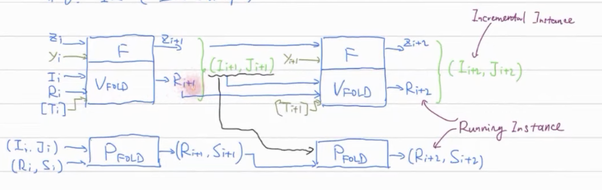

# Nova一镜到底

## 0x00 动机

共学社区产出了很多的Nova相关文章，但是总感觉没串在一起，对于我这种愚笨的小白来说还是不太友好。

因此，我想从一位小白的视角描述我学习Nova的过程，当然不可避免首先要学习社区中大佬们已有的解读文章。本文主要还是把Nova的脉络理清楚，然后补充一些小白视角下的疑问解答（请教了不少老师）。从头到尾捋一遍也有助于我对Nova的理解。

希望大家各有所获！！

## 0x01 问题的起源

### ZK证明系统

关于zk证明系统的来龙去脉，由于不是本文的重点，就不详细介绍了，相信看这篇文章的同志多少还是对ZK证明系统有所认知的。

在这里主要是从**主观**的角度描述ZK证明系统在工业界的可能热门迭代方向：**无需Trusted setup**和**优化证明效率**。当然，ZKP方向当然不仅仅只有这两个方向，理论界还有很多别的发展方向，在此不做讨论。

其中，**优化证明效率**方向我将其分为两个层面，如下表：

<div align=center></div>

解释：

1. 协议层的优化方向分为lookup和Acc/Folding（也可以说Recursion），但是这两者不是互斥的选项，意味着可以同时采用这两种方式构建加速证明效率的方案。
2. 执行层的优化方向分为分布式并行计算和硬件加速，同样的，此二者也不是互斥的选项，可以同时采用分布式并行计算和硬件加速，参考2023年zPrice的[PLONK-DIZK](https://www.zprize.io/prizes/plonk-dizk-gpu-acceleration)。

可以看到，Nova是作为一种协议层的加速证明效率（递归证明）方案出现的。

### 【Why】为什么需要递归证明？

当使用ZK证明系统时，首先需要注意：**一个复杂且庞大的计算在单个证明系统中证明是低效且不切实际的**。这是因为我们需要把计算任务转换成电路，然后把电路、公共输入以及见证输入到证明系统中生成证明。当电路规模增加到一定数量级之后，证明速率会大大降低，甚至证明者由于实际内存限制根本无法生成证明。

再者，需要注意我们通常要求证明系统的**验证复杂度不能太高**，也就是所谓的简洁性 succinctness，在ZKP上下文中，简洁性一般指电路规模的多项式对数（poly-logarithmic）级别。【多项式对数是一种复杂度计算术语，表示为 $n^k\log^m n$】

在上述两点的条件限制下，如何对一个复杂且庞大的计算在单个证明系统中进行证明，并且保证验证者的验证成本在可接受范围内呢？

研究人员提出了三种「高效」证明思想：

1. 证明组合（Proof Composition）：将使用不同特点的证明系统组合起来以生成最终证明。比如可以先使用一个快速的证明系统，但是可能生成的proof size较大。为了减小proof size，可以再组合一个较慢的证明系统，用于证明「快证明系统」的证明可以通过验证者验证。注意，第二个「慢证明系统」其实证明的是第一个「快证明系统」的验证者电路，而验证者电路一般复杂度是较低的。因此，通过证明组合，我们可以实现用相对较快的方式证明一个复杂的计算电路的运行过程。

2. 证明聚合（Proof Aggregation）：将多个proof聚合成一个单一的proof。比如zkEVM包含了许多不同的电路，如EVM电路、RAM电路、存储电路等。在实践中，验证所有这些证明在区块链上是非常昂贵的。因此，我们使用证明聚合，即使用一个证明来证明这些多个子电路证明是有效的。这个单一的证明在区块链上更容易被验证。因此，这种证明思想下，需要首先各自运行证明系统分别生成证明，最后使用一个聚合证明的证明系统以证明各个证明的验证有效性和聚合的合法性。这种时间复杂度还是很高的。

3. 证明递归（Proof Recursion）：这是一种更为高明的证明思想，它旨在把复杂业务电路分割成相对小的计算电路，然后构建一连串验证者电路（**也就是说每次在进行业务电路运算的时候，顺带着把上一次的电路运行证明进行部分或者全部验证**），这样可以有效的**摊销**验证成本。如果每次运行的业务电路是一样的（即IVC，见后文解释），那么这样每一步我们可以生成一个比前一个证明更容易验证的证明。最终，我们只需要用最低的复杂度来验证最终的证明。

   注意上述加粗语句中，部分验证对应于Accumulator，全部验证对应于Folding。

通过上面的解释可知：递归证明可以有效的证明一个复杂且庞大的电路。

### 【What】Nova可以应用于什么领域？

正如之前所述，实际应用中总是希望能够证明多个计算任务（大型复杂的计算任务可以拆解成多个小的计算任务，比如zkVM）的正确运行。Nova，它是一种基于折叠Folding的证明技术，它的最主要用途就是实现高效证明IVC。

IVC，即增量可验证计算Incrementally Verifiable Computation。当我们有一个很长的计算，这个计算是循环执行函数 $F$。比如，区块链上处理交易，我们把它抽象成一个函数 $F$，它以原始区块链状态和新的交易作为输入，输出更新之后的区块链状态。

一个非常自然的证明方案是：每次运行 SNARK 方案，然后输出更新之后的区块链状态及其proof，然后在下一次运行状态更新函数之前，需要先验证上一次proof的正确性，然后在执行这一次的运行证明，如此往复。

显然上述方案是低效的，一个比较高明的想法是，我们把验证函数也写成电路，然后将其与下一次执行函数一起运行并证明。这样引入了一个新的问题，验证函数并不适合转换成电路，比如配对pairing部分。于是研究人员提出了延迟验证的想法，即把不易验证的部分延迟到最后去验证，这就是所谓的累加Accumulator方案，代表作有Halo系列证明系统。而Nova证明系统，则更为彻底，它把前一步的验证步骤全部执行，不需要延后验证。

而Nova的变种方案，则是在Nova基础上更进一步了：

- SuperNova：不同于Nova只能证明IVC（即同样的计算任务），它将Nova推广到non-uniform IVC上，即我们在IVC链上能运行多个方法，并且每个方法都可能在IVC上出现多次。
- Sangira：是针对于 PLONKish 算术化的 folding 方案。它支持复制约束（copy constraints）和 2 阶的自定义约束（degree-2 custom constraints），但不支持高阶自定义约束（high degree custom constraints）和查找约束（lookup constraints）。
- HyperNova：引入了Customizable Constraint Systems（CCS）算术化的折叠方案。 HyperNova 支持高阶自定义约束和查找约束，并使用sum-check protocol来避免执行大量的FFT（快速傅里叶变换）。
- ProtoStar：进一步增强了折叠方案，支持高阶自定义约束、查找约束和non-uniform IVC。
- 故事未完待续...

【TODO】: HyperNova, ProtoStar, UltraPlonkova.....

## 0x02 Cyrpto Primitives

本节主要介绍 Nova 证明系统中需要使用到的密码学原语。首先是两个算术电路友好型哈希函数，pedersen 和 poseidon ，

### Pedersen Hash

哈希函数可以将任意输入，映射为固定长度的输出。Pedersen 哈希函数其实是非常自然的一种构造，它把消息的比特串按照固定长度分组编码，然后根据随机选择的若干群生成器，对应进行群元素的点乘，相加即可得到最终的哈希值。Pedersen 哈希有以下特点：

- 编码函数 `encoding()`：用于对消息分组编码，实践中一般输出一个域元素。
- 随机性：需要对群生成元进行随机取样，才能确保安全性。
- 输出：最终输出的哈希摘要实质上是一个群元素。

更正式地表达：给定消息是规模为 $k * r$ 的比特串，即可以按照 $r$ 长度将其分为 $k$ 组。然后随机在指定配对友好型椭圆曲线的素数阶子群中选择 $k$ 个生成元 $g_1, g_2, \dots, g_k$ 。这些生成元必须是随机均匀取样，使得两两之间的关系是无从知晓的。最后计算 pedersen hash $h=m_1g_1+m_2g_2+\dots+m_kg_k$ 。其中如何把 $r$ 大小的 bits 分组编码成 $m_i$ 需要设计成一个 encoding_function （可以简单地将其转化成 ASCII 码，也可以像zcash一样自定义）。

下面是 sage 的 PoC 代码：

```sage
# Definition
F = GF(127)
E = EllipticCurve(F, [F(1), F(42)])    

assert E.order().is_prime()
print(E.order())

G1 = E(1, 60)
G2 = E(2, 59)
GENERATORS = [G1, G2]

def IdentityEncode(lebs):
    return int(lebs[::-1], 2)

def EncodeMessage(msg, encode_function):
    return [encode_function(x) for x in msg]

def GenericPedersenHash(generators, encoded_chunks):
    assert len(generators) == len(encoded_chunks), "Incompatible lengths"
    
    res = E(0)
    
    for chunk, generator in zip(encoded_chunks, generators):
        res += chunk * generator
        
    return res

def PedersenHash(msg, encode_function=IdentityEncode, generators=GENERATORS):
    encoded_msg = EncodeMessage(msg, encode_function)
    return GenericPedersenHash(generators, encoded_msg)

def ZcashEncode(bin_value):
    r"""
    Zcash's encoding function (·): encodes `bin_value`, a binary value in little-endian bit order to an element
    in the range {-(r-1)/2 .. (r-1)/2}\{0} with r the subgroup order
    """
    
    def enc(b):
        """
        Zcash's 3-bit signed encoding function
        """
        return (1 - 2 * int(b[2])) * (1 + int(b[0]) + 2 * int(b[1]))
    
    assert len(bin_value) % 3 == 0
    
    res = 0
    for j, a in enumerate(range(0, len(bin_value), 3)):
        bchunk = bin_value[a: a+3]
        res += enc(bchunk) * (2 ** (4 * j))
    return res

def ZcashPedersenHash(message, generators=GENERATORS):
    return PedersenHash(message, encode_function=ZcashEncode, generators=generators)
        

message = ["010101", "000111"]
H = PedersenHash(message)
print(f"Hash of {message} is {H}")

assert H == 42 * G1 + 56 * G2, "Nope"
```

#### Security Requirements

1. Collision Resistence：为了实现抗碰撞这一特性，要求输入长度是固定的且编码函数必须是单射（injective）的。

   比如上述代码示例中，如果编码函数输出的标量值大于 subgroup 的阶 139，那么攻击者就有可能制造碰撞。

   ```sage
   # Collision-resistant: One should ensure its encoding is smaller than the subgroup order
   H2 = (42 + 139) * G1 + (56 + 139) * G2
   assert H == H2, "Nope"
   print(int("10110101", 2))
   ```

   如果输入可变，则也会导致碰撞，比如：

   ```sage
   message = ["010101", "111000"]
   colliding_message = [message[0] + "000", message[1][:3]]
   print(f"Colliding Message: {colliding_message}")
   # Colliding Message:  ['010101000', '111']

   assert PedersenHash(colliding_message) == PedersenHash(message)
   ```

2. Randomness：之前已经说过，必须随机挑选群生成元，确保二者之间联系是无人知晓的（即使是协议设计者）。

   如果生成元之间的关系泄漏，那么就可能造成攻击。比如：

   ```sage
   # We know the discrete logarithm of G2 with respect to G1
   assert 35 * G1 == G2
   message = ["010101", "000111"]  # M = [42, 56]
   encoded_message = EncodeMessage(message, ZcashEncode)
   print(f"Encoded Message: {encoded_message}")

   H = ZcashPedersenHash(message)
   assert 129 * G1 == H

   # We need to find a message M' = M1' || M2' such that
   # <M1'> + 35*<M2'> =  (-29 -35*63 ) = 129 mod 139
   H2 = GenericPedersenHash(GENERATORS, [17, 31])
   assert H == H2
   print(ZcashEncode("000000"))

   H3 = ZcashPedersenHash(["000000", "001100"])
   assert H == H3
   # Encoded Message:  [-29, -63]
   ```

关于 Pedersen hash 在实际应用还有很多有趣的安全问题，如果想继续学习这方面的知识，可以尝试 ZKHACK [Let's hash it out](https://zkhack.dev/events/puzzle1.html)。我也分享了带有代码的 [wp](https://github.com/Xor0v0/ZKHack-Solutions/tree/main/Let's%20Hash%20it%20out)。

### Poseidon

[Poseidon hash](https://eprint.iacr.org/2019/458.pdf) 也是一个 SNARK 友好型哈希函数，与 keccak hash 和SHA-3 hash一样，它的构造也参考了 [sponge functions](https://pdfs.semanticscholar.org/a949/02166ba971cbb6d0e31bbf4c51b000fbeae5.pdf?_ga=2.13918709.372950161.1571046613-1498580965.1561015485) 的模型。

简单来说，sponge函数（也称海绵函数）分为两个步骤，如同海绵一样，先吸收（absorbing），再挤压（squeezing）。笼统来说，其实就是先把消息分组，然后使用一个内部置换函数逐步的把这些分组消息「吸收」进来，然后再「挤压」出规定数量的哈希值。

除了那个内部置换函数，Poseidon hash还需要定义两个参数，即比率 $r$ 和容量 $c$ 。其中 $r$ 决定了吞吐量， $c$ 与安全等级有关。这意味着，当确定了固定输入的内部置换函数，实现者需要在吞吐量和安全等级之间作出取舍平衡。

<div align=center></div>

这里不再深究内部置换函数的细节，如有需要可自行阅读论文。我比较关心其安全问题，推荐两个深入学习材料： [审计poseidon的安全参数](https://research.nccgroup.com/2022/09/12/public-report-penumbra-labs-decaf377-implementation-and-poseidon-parameter-selection-review/)和[Scalebit CTF Roundabout](https://github.com/scalebit/zkCTF-day1/tree/main/Roundabout)。

## 0x03 R1CS改造计划

Nova 是一个针对 R1CS Arithmetization 的递归证明系统，当然目前电路算术化 Arithmetization 方式还有很多，比如 PLONKish，AIR，CCS 等，也出现了针对这些算术化的 Nova 变体。本文只讨论 Nova 原始论文，因此本小节详细介绍 R1CS 算术化及其松弛版本。

### 1. Stantard R1CS

首先需要理解：Arithmetization 其实就是把待证明陈述转化为 [Circuit-Satisfiability](https://en.wikipedia.org/wiki/Circuit_satisfiability_problem)（C-SAT）问题。C-SAT 问题是一个经典的布尔可满足性问题，即确定在给定的布尔电路中是否存在一组输入值，使得电路的输出为真。**C-SAT是一个NP-Complete问题，目前尚未找到 PPT 算法可以解决它**。

研究人员已经证明：

- 通过增加常数级的电路门和电路深度，任何布尔电路可以转换为算数电路。
- 任意的 C-SAT 问题都可以转换为 R1CS 可满足问题。

所以，当我们证明一个电路可满足问题时，实质上可以转换为 R1CS 可满足问题。那么 R1CS 是什么？

R1CS 系统全称一阶约束系统，它实质上是把电路转化为一个**矩阵等式**。具体而言，考虑如下 `isZero`电路：

```circom
template IsZero() {
	signal input in;
	signal output out;
	
	signal inv;
	inv <-- in != 0 ? 1/in : 0;
	out <== -in * inv + 1;
	in * out === 0;
}
```

将其转换成电路有：

<div align=center></div>

注意在 R1CS 算术化中，电路的每一根导线都定义一个名字，记为 $x_i$ ，但是正如你所见，以常数作为输入的导线没有标记，这是因为在矩阵中有专门的一列（ $x_0$ ）供其使用，并且同一个输入的导线标记是相同的，比如 in 连接两个导线。

然后以每个乘法门为中心，根据导线的输入构造矩阵 $L, R, O$ ，分别对应乘法门的左输入、右输入和输出导线。

比如左输入矩阵：

$$
L=\begin{pmatrix}
0&1&0&0&0&0\\
0&0&1&0&0&0\\
0&1&0&0&0&0
\end{pmatrix}
$$

不难发现，矩阵的列数对应导线标记，矩阵的行数对应乘法门的个数。即 $L,R,O$ 矩阵的都是 $m\times n$ 的，$m$ 表示乘法门的个数， $n$ 表示输入输出导线的条数。

R1CS 可满足问题是说，对于给定的上述代表空白状态电路的三个矩阵，存在一个 witness 向量 $\vec{z}$（即对每根导线赋值），满足： $L\vec{z}*R\vec{z}-O\vec{z}=0$ 。其中矩阵与向量之间是点乘（省略，最基本的矩阵运算）， `*` 表示hadamard product，表示两个矩阵对应元素相乘。

对于向量 $\vec{z}$ ，它表示一组见证 witness ，它见证了整个计算过程的完成，保证 Prover 诚实地运行了整个电路（完成了整个计算过程），不然它无法得到每个导线的值。显然，**每条导线上的值就是对计算过程的见证**。特别的，规定 $x_0=1$ 恒成立。

安全性假设：由于 C-SAT 问题等价于 R1CS 可满足问题，且 C-SAT 问题是 NPC 问题，因此拥有 PPT 算力的 Prover 无法构造出满足要求的 witness 向量，除非它诚实地运行整个电路。

数学语言表述 R1CS 可满足问题：一阶约束系统 R1CS 是七元组 $(\mathbb{F},\pmb{A,B,C},\vec{io}, m,n)$ 。 其中 $\vec{io}$ 是公共输入输出向量， $\pmb{A,B,C}$ 是三个 $m\times m$ 的矩阵， $n$ 是所有矩阵中非 0 值的最大数目。称 R1CS 问题是可满足的，当且仅当对于一个 R1CS 元组，存在证据 $\vec{w}$ 使得 $(\pmb{A}\vec{z})\odot(\pmb{B}\vec{z})=\pmb{C}\vec{z}$ 其中 $\vec{z}=(\vec{io},1,\vec{w})^T$ 。其中 $\odot$ 表示hadamard product，两个矩阵元素对应相乘。

其中，定义R1CS 的 Instance 为 $\mathcal{I} = \vec{io}$ ，因为对于空白状态电路，这样一组公共输入输出唯一确定了电路的运行状态；定义 $\mathcal{W} = \vec{w}$ 为R1CS 的 Witness，表示电路的运行状态。因此 $\vec{z}=({\mathcal{I}, 1, \mathcal{W}})^T$ 。

> 这里有人可能疑惑为什么 R1CS 矩阵的定义是方阵 $m\times m$，而不是我们之前所描述的 $m\times n$ ？
> 
> 郭老师：这是由于在实际实现中，需要把矩阵按照 2 的幂进行对齐，而且大概率会对齐到同一个数 $m$ ，因此就将其简单表示为方阵。而 $n$ 表示矩阵中的非零值，这个实际意义还没有研究过。

以上就是标准的 R1CS 算术化，它被广泛运用到很多零知识证明系统中，如 Groth16，Spartan。

### 2. Relaxed R1CS

标准的 R1CS 算术化对于单个计算任务是适用的，但是当我们谈到多个计算任务时，情况变得复杂起来。

假设我们对同一个电路 $F$ 计算 $n$ 次，那么意味着要对 R1CS 的矩阵等式进行 n 次证明与验证。Nova的核心思想是折叠（Folding），意思是：把 $n$ 次运行的 witness 向量 $\vec{v}_1, \dots, \vec{v}_n$ 折叠压缩成一个 $\vec{v}^* $ ，使 $\vec{v}^* $ 和 R1CS 矩阵仍然满足某个矩阵等式。这样我们就可以一次性证明 $n$ 次计算的正确性了。

Folding：对于两个数 $(a_1, a_2)$ 的折叠是很简单的，只需要随机选择一个随机值 $r$ ，则二者就可以折叠成 $a_1+ra_2$ 。这样的情况不适用于对 witness 向量的压缩：简单起见，考虑两个向量 $\vec{w}_1,\vec{w}_2$ 。我们随机选取一个随机值 $r$ ，计算压缩之后的向量为： $\vec{w}^* =\vec{w}_1+r\vec{w}_2$ 。但是问题在于，折叠之后的向量不满足之前的矩阵等式了，即 $(\pmb{A}\vec{z}^* )\odot(\pmb{B}\vec{z}^* )\neq\pmb{C}\vec{z}^* $ 。

简单验证：

$$
\begin{align*}
LHS: (\pmb{A}\vec{z}^* )\odot(\pmb{B}\vec{z}^* )&=\pmb{A}(\vec{z}_1+r\vec{z}_2)\odot \pmb{B}(\vec{z}_1+r\vec{z}_)\\
&=\pmb{A}\vec{z}_1\odot \pmb{B}\vec{z}_1 + r^2 \pmb{A}\vec{z}_2\odot \pmb{B}\vec{z}_2 + r (\pmb{A}\vec{z}_2\odot \pmb{B}\vec{z}_1 + \pmb{A}\vec{z}_1\odot \pmb{B}\vec{z}_2)\\
&=\pmb{C}\vec{z}_1 + r^2 \pmb{C}\vec{z}_2 + {\color{red}r (\pmb{A}\vec{z}_2\odot \pmb{B}\vec{z}_1 + \pmb{A}\vec{z}_1\odot \pmb{B}\vec{z}_2)}
\end{align*}
$$

红色部分就是所谓的交叉项（cross term），这显然不是我们想要的结果。

因此没办法直接对标准的 R1CS 进行 fold，Nova提出了一种松弛版本（Relaxed）的 R1CS，将矩阵等式变化为： $(\pmb{A}\vec{z} )\odot(\pmb{B}\vec{z} )=u (\pmb{C}\vec{z}) + \vec{E}$ 。其中 $u\in \mathbb{F}, \vec{E}\in \mathbb{F}^m$。引入 $\vec{E}$ 主要是为了收集红色部分的交叉项，它被称为误差向量（Error vector）。

这个 Relaxed R1CS 等式满足定理： 如果 $(\pmb{A}\vec{z}_1 )\odot(\pmb{B}\vec{z}_1 )=u_1 (\pmb{C}\vec{z}_1) + \vec{E}_1$ ， $(\pmb{A}\vec{z}_2 )\odot(\pmb{B}\vec{z}_2 )=u_2 (\pmb{C}\vec{z}_2) + \vec{E}_2$ ，那么折叠之后 witness 向量 $\vec{z}^* $ 满足 $(\pmb{A}\vec{z}^* )\odot(\pmb{B}\vec{z}^* )=u^* (\pmb{C}\vec{z}^*) + \vec{E}^* $ ，其中 $u^* = u_1 + ru_2, \vec{z}^* = \vec{z}_1 + r\vec{z}_2, \vec{E}^* =\vec{E}_1 + r^2 \vec{E}_2 + r \vec{T}, \vec{T}=\pmb{A}\vec{z}_2\odot \pmb{B}\vec{z}_1 + \pmb{A}\vec{z}_1\odot \pmb{B}\vec{z}_2 - u_1 (C\vec{z}_2) - u_2(C\vec{z}_1)$ 。（自行验证正确性）

我们定义 Relaxed R1CS Instance： $\mathcal{I}=(u, \vec{io}, \vec{E})$ ，Relaxed R1CS Witness $\mathcal{W}=\vec{w}$ ，相应地 $\vec{z}=({\mathcal{I}, 1, \mathcal{W}})^T $ 。

但是这样又引入了新问题：在计算 $\vec{z}^* = \vec{z}_1 + r\vec{z}_2$ 时，由于 $\vec{z}$ 中包含了 $\mathcal{I}$ ， $\mathcal{I}$ 中存在 $\vec{E}$ ，而 $\vec{E}$ 中又包括 $\vec{T} = \pmb{A}\vec{z}_2\odot \pmb{B}\vec{z}_1 + \pmb{A}\vec{z}_1\odot \pmb{B}\vec{z}_2 - u_1 (C\vec{z}_2) - u_2(C\vec{z}_1)$ ，注意到 $\vec{z}_i$ 中是需要 $\mathcal{W}_i$ 的。

> 为什么 Instance 里面不能引入上一次电路运行的 witness 向量呢？
>
> 如果 Instance 里面有上一次电路运行的 witness （包含在 $\vec{T}$ 中），那么折叠的证明者（folding prover）必须向验证者（folding verifier）提供见证以计算 $\vec{E}$ 。这使得折叠方案不是 non-trivial （因为 Verifier 的工作量较大，且通信量增大），也不是零知识的（Verifier 知道 witnesses ）。

### 3. Committed Relaxed R1CS

由于我们不想让 Relaxed R1CS Instance 中出现上一次电路运行的 witness 向量，因此又对 Relaxed R1CS 继续改进，改进点就是把 Instance 中的 $\vec{E}$ 变成 $\vec{E}$ 的承诺，这样会就不会引入了。于是，Relaxed R1CS Instance 变为 $\mathcal{I}=(u, \vec{io}, [\vec{E}], [\vec{w}])$ ，而 Relaxed R1CS Witness 变为 $\mathcal{W}=(E, \vec{w})$。

注意这里引入了一个 commitment scheme，意味着在 Prover 自己在 Folding 的过程中还需要设计对承诺的验证（即下一章阐述的第一对 Prover-Verifier）。

## 0x04 Basic Folding Scheme(NIFS)

本节介绍 Prover 的 Folding 过程，也就是当 Prover 执行了 n 次电路，拿到了 n 个 Instance-Witness 向量对，如何把这些 witness 向量折叠压缩成一个 $\vec{z}^*$ 的过程。最终 Prover 只需要证明折叠之后的 witness 向量满足 Relaxed R1CS 的矩阵等式即可。由于引入了一个具备加法同态特性的承诺方案来确保 Prover 正确进行了 fold，因此需要介绍第一对Prover-Verifier，此二者进行折叠的过程被称为 **NIFS** ，即非交互式折叠方案（Non-Interactive Folding Scheme）。

### Parties of NIFS

NIFS Prover：它同时拥有电路的 Relaxed R1CS Instances $\mathcal{I}_1,\dots, \mathcal{I}_n$ 和 Relaxed R1CS Witnesses $\mathcal{W}_1,\dots, \mathcal{W}_n$ 。它需要对这些 Instance-Witness pairs 进行 fold。

NIFS Verifier：只拥有电路的 Relaxed R1CS Instances $\mathcal{I}_1,\dots, \mathcal{I}_n$ ，只需要对两个R1CS Instance进行fold 。

其实还存在一个第三者，它需要负责对两者每个step fold后的 Relaxed R1CS Instance 进行匹配校验，以及一系列step fold之后R1CS Instance-Witness pairs对进行校验。

### Procedure

<div align=center></div>

上图是一个 fold step 的简易协议图。一个 fold step 就是要把两个 Relaxed R1CS Instance-Witness pairs 折叠成一个 Instance-Witness，并且需要确保 Fold 结果的可靠性。

协议中 Prover 肯定是拥有全部的 $n$ 个 Instance-Witness pairs 信息，因为只有它才需要完整的执行整个电路 $n$ 次。

我们观察其中一次 fold step：Prover 需要折叠 $(\mathcal{I}_1, \mathcal{J}_1),(\mathcal{I}_2, \mathcal{J}_2)$ 为 $(\mathcal{I}^{*} , \mathcal{J}^{*})$，其中 $\mathcal{I}_1 = (u_1, \vec{io}_1, [\vec{E}_1], [\vec{w}_1]), \mathcal{I}_2=(u_2, \vec{io}_2, [\vec{E}_2], [\vec{w}_1]), \mathcal{J}_1 = (\vec{E}_1,\vec{w}_1), \mathcal{J}_2 = (\vec{E}_2, \vec{w}_2)$ ，得到的 $\mathcal{I}^{*} = (u^{*}, \vec{io}^{*}, \vec{E}^{*})$ 。

1. 由于 Verifier 需要验证 fold 的正确性，但是无法自己计算 T ，因此首先 Prover 需要计算 T 然后将 T 的承诺发送给 Verifier。

2. Verifier 收到 T 的承诺之后，随机抽样一个随机值，发送给 Prover。

3. 随后双方给自己算 fold 之后的 Instance-Witness pair。

图中还缺少一步第三方**检验**的步骤，但是 Nova 设计者巧妙设计将这一检验步骤交由 Prover 自证。（这点很重要，也很巧妙，在下一节会讲）

不难发现上述协议是一个交互协议，Verifier需要生成随机挑战值 challenge factor。我们可以使用一个 Fiat-Shamir 变换将其转换为非交互式协议。如此一来，我们就得到了一个非交互式折叠方案（NIFS）。

## 0x05 IVC Folding Scheme

上一节介绍了单个 fold step 的方案，这一节我们学习如何对一个完整的IVC 进行折叠。为了直观的展示 IVC folding 的流程，还是以区块链根据交易更新状态为例。

### Single Computation Case
假设状态更新函数为 $F$ ，函数的输入是原始状态 $S$ 和交易 $T$，输出是新的状态。那么检验这样单个计算任务的正确性，我们可以通过最直接的方式生成 proof 。

<div align=center></div>

首先将 $S0, T0$ 输入到电路中，获得输出，于是我们可以构建 R1CS Instance $\mathcal{I}=(S_0, T_0, S_1)$ ，R1CS Witness $\mathcal{W}=(w_0,w_1,\dots)$ ，然后将其输入到证明系统即可得到 proof。

### IVC without Folding

在 Folding 思路出现之前，解决 IVC 问题有两种思路：

第一种 naive 方案是每运行一次电路，在下一次运行之前先检查上一步的 proof 正确性，以此类推。甚至，可以把整个验证步骤也变成电路，当下一次执行业务电路的同时，验证上一步电路的运行正确性。

<div align=center></div>

第二种是 Accumulator 方案，由于验证电路有些步骤无法高效地在电路中实现（比如 pairing ），因此这类方案的思路是：把这些难以电路化的操作延迟到最后一步验证，也叫累加 Accumulator。如下图：

<div align=center></div>

### IVC with Folding

Nova 第一次提出使用 Folding 思想来证明 IVC 问题，其主要思路是利用 NIFS 不断折叠压缩 Relaxed R1CS Instance-Witness pairs。

首先，对于 NIFS 方案，我们需要把 Fold Verifier 电路化。一定要明确，我们的最终目的是为了把若干标准的 R1CS Witness vector $\vec{z}$ 合并成一个标准的 R1CS Withness vector，使其满足矩阵等式（暂且定义为 R1CS SAT）。由于上述折叠方案不可行，我们才考虑 Relaxed R1CS(它满足Relaxed R1CS SAT的)。进而为了隐私性和减少Verifier 的工作量，所以才对 witness 做承诺，即 Commited Relaxed R1CS。而 NIFS 方案中的 Fold Verifier 其实就是为了保证 Fold Provier 不作假，因而 NIFS 方案中，Fold Prover 和 Fold Verifier 都需要去 Fold Instance、Fold (Committed) Witness，然后「第三方」去验证二者的 Instances 是否相等（注意不需要检验 Witness，原因是为了保护隐私，并且如果 Instance 相等，则 Witness 一定满足 Instance）。

在上一节中，我们提到 Nova 设计者实际上巧妙地让 SNARK Prover 自证（注意不是 Fold Prover），从而避免引入第三方。如何做到？答案是：**当前 step 对应的电路会校验前一个 step NIFS Prover 离线 fold 的Instance 与 NIFS Verifier 线上fold的Instance 是否相等**。因为当前 step 的 NIFS Verifier电路对于上一个step NIFS Verifier电路和离线的NIFS Prover 来说就是第三方，所以这么设计逻辑上是走得通的。既然是当前step 校验上一个 step ，那最后一个 step 谁来校验？答案很简单，在电路的外面执行。在最后一个 step 后，电路外面会 check 一下最后一个step Primary/Secondary 电路 fold 的结果是否分别与离线 fold 的结果相等。

总结：Fold Verifier 电路需要进行两项任务，首先验证前一个 step 中 Fold Prover 与 Fold Verifier 输出的 Instance 是相等的，其次需要计算这一 step 需要输出 Instance，以供下一 step 验证。

我们同样使用区块链根据交易 $Y$ 更新状态的例子， $F$ 作为状态更新的业务电路。这里需要定义一下两个概念， `Incremental Instance-Witness pair` 表示需要被折叠的那些 Relaxed R1CS Instance-Witness pairs， `Running Instance-Witness pair` 表示已经折叠完毕之后的那个 Relaxed R1CS Instance-Witness pair。为了区分，我把前者记为 $(\mathcal{I, W})$ ，后者记为 $(\mathcal{RI, RW})$ 。

不失一般性，我们考虑第 $i$ 次折叠，之后再考虑极端情况。根据上述思路，可以画出如下协议运行图：

<div align=center></div>

$F$ 接受两个公共参数 $Z_i, Y_i$，输出 $Z_{i+1}$ ，这就构成了 Commited Relaxed R1CS Instance $\mathcal{I}_{i+1}=(u_{i+1} ,(z_i, Y_i, z_{i+1}, \mathcal{I}_{i}, \mathcal{R}_{i}, [\vec{T}_i], \mathcal{RI}_{i+1}), [\vec{E}_{i+1}], [\vec{w}_{i+1}])$ ，Commited Related R1CS Witness $\mathcal{W}_{i+1}=(\vec{E}_{i+1}, \vec{w}_{i+1})$ 。这里的 Fold Verifier 和 Fold Prover 就是对应 NIFS 方案里的 Verifier 和 Prover。唯一不一样的是， 这里的 Fold Verifier 电路除了生成 $\mathcal{RI}_{i+1}$ ，还需要检验上一步的两者生成的 $\mathcal{RI}_i$ 是否相等（所以我们需要把 Prover 生成的 $\mathcal{RI}_i$ 输入到电路去）。

但是这样的构造是有问题的，原因在于：如果我们直接输出 Fold Verifier 电路所生成的 $\mathcal{RI}_{i+1}$ ，那势必造成所形成的 $\mathcal{I}_{i+1}=(u_{i+1} ,(z_i, Y_i, S_{i+1}, \mathcal{RI}_{i+1}), [\vec{E}_{i+1}], [\vec{w}_{i+1}])$ ，注意到 $\mathcal{I}_{i+1}$ 中出现了 $\mathcal{RI}_{i+1}$ ，者意味着二者不等长，那么我们下一步就没办法进行 fold 了。

为了解决这个问题，Nova 设计者引入了 hash 函数，我们需要让 fold verifier 计算出 $\mathcal{RI}_{i+1}$ ，但是又不能让它作为公共输出，影响下一次 fold。

<div align=center></div>

图中粗略的描述了对于 fold verifier 的改造：新增上一步骤 fold verifier 电路所计算的哈希 $H(i, z_0, z_i, \mathcal{RI}_{i})$ 作为公共输入，还有这一步骤中业务电路中计算出来的 $\mathcal{RI}_{i+1}$ 作为私有输入。这样就可以避免长度不匹配的问题，但是注意这里面的公私有输入规定。

极端情况：当第一次 fold 时，验证电路输出的哈希 $H(1, z_0, F(z_0, w_i), u)$ ； 当最后一次 fold 时，生成的 $(\mathcal{RI}_{n}, \mathcal{RW}_{n})$ 是没有经过验证的，这一验证步骤留给之后的 SNARK 。

由此，我们终于把 IVC 的所有 Commited Relaxed R1CS Instance-Witness pairs 压缩到一个 Instance-Witness pair。后续的工作就是证明这一个 pair 满足 Relaxed R1CS 矩阵等式。

### 一些小问题

1. 注意到 fold verifier 电路需要以 $(\mathcal{RI}_{i+1}$ 作为输入，这就涉及到电路设计逻辑了。开发者设计了 `Primary-Secondary` 电路逻辑。分工如下：
   - Primary 电路负责执行业务电路，并 commit 输出 Commited Relaxed R1CS instance 给 Secondary 电路；
   - Secondary 电路负责执行 fold verifier 电路，输出之前所述的 哈希结果。

2. 上述对 IVC 的 folding 过程只针对业务电路的 Instance-Witness Pairs，上述 folding 过程的正确性需要依靠 fold verifier 电路的正确运行，因此，又需要对 fold verifier 电路执行的 Instance-Witness Pairs 进行 folding。这样的话，又需要folding，即又要引入一层fold verifier，陷入了死循环？

   <div align=center></div>

   这里需要引入 Cycle curves，即把对业务电路的验证放到业务电路中去做。Cycle curves为什么允许这么操作呢？具体细节在第七节再讨论。

## 0x06 Spartan


## 0x07 Full Nova

这里介绍第三对Prover-Verifier

### Summary

总结一下Nova证明系统的特性：

- No Trusted Setup.
- No Polynomial Multiplication(No FFT!!).
- The Nova prover run time is group exp(MSM) of size $O(|F|)$, which theoretically 5-50 times faster than Groth16, Plonk, Halo, and other solutions.
- The verifier circuit of Nova is constant: 2 scalar multiplication. So the **recuision threshold** can be ....
- The proof size is $O(|\log F|)$.

## 0x08 Code Structure&Example


## 0x09 Nova+ZKML

准备把毕设搞过来简单说一下

## Reference

Vedios:

- [by 作者Srinath Setty [EN\]](https://www.youtube.com/watch?v=mY-LWXKsBLc)

- [by 郭宇@安比: A short introduction to Nova [EN\]](https://www.youtube.com/watch?v=hq-1bLVz59w&t=324s)

- [by 郭宇@安比: Nova - Recursive SNARKs without trusted setup [中文\]](https://www.youtube.com/watch?v=l19roUItyUE)

- [Nova Crash Course with **Justin Drake** [EN\]](https://www.youtube.com/watch?v=SwonTtOQzAk&t=2815s)

Papers:

- [Nova: Recursive Zero-Knowledge Arguments from Folding Schemes](https://eprint.iacr.org/2021/370.pdf)
- [Revisiting the Nova Proof System on a Cycle of Curves](https://eprint.iacr.org/2023/969)

Blogs:

- [difference between base field and scalar field](https://crypto.stackexchange.com/questions/66436/for-an-elliptic-curve-what-is-the-difference-between-the-base-field-modulus-q)
- [order of ecc](https://medium.com/asecuritysite-when-bob-met-alice/whats-the-order-in-ecc-ac8a8d5439e8)
- [Scalable Zero Knowledge via Cycles of Elliptic Curves](https://eprint.iacr.org/2014/595.pdf)
- [The halo2 book](https://zcash.github.io/halo2/index.html)
- [Nova based zk VM](https://hackmd.io/@monyverse/H1XSVmHNh#Curve-Cycling)
- https://mp.weixin.qq.com/s/WPh8b6otBdan3JHejF9zVg
- https://snowolf0620.xyz/index.php/zkp/1267.html